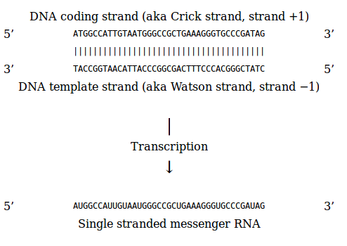

**This work is licensed under a [Creative Commons Attribution-ShareAlike 3.0 Unported License](http://creativecommons.org/licenses/by-sa/3.0/deed.en_US). This means that you are able to copy, share and modify the work, as long as the result is distributed under the same license.**

# Concordia Python workshop - module 3 - Intorduction to Biopython   

by Mathieu Bourgey, _Ph.D_  

This Workshop is an adaptation of the [general Biopython tutorial](http://biopython.org/DIST/docs/tutorial/Tutorial.html)

## Learning objectives
During this wiorkshop you will learn:  

 - Manipulate Sequence Objects
 - Annotate Sequence Objects
 - Read/write Fasta file
 - Blasting Sequences
 - Searching over Pubmed database

 

## The Seq Object
Biological sequences are arguably the central object in Bioinformatics. Biopython sequences are essentially strings of letters like **AGTACACTGGT** as seen in common biological file formats.

The Biopython `Seq` object is defined in the `Bio.Seq` module

The `Seq` object is different from traditional python strings:  

 1. It supports most of the string methods but it also comes with its specifc set of methods
  * translate() _- Turns a nucleotide sequence into a protein sequence._
  * reverse_complement() _- Returns the reverse complement sequence._
  * complement() _- Returns the complement sequence._
  * transcribe() _-Returns the RNA sequence from a DNA sequence._
  * back_transcribe() _- Returns the DNA sequence from an RNA sequence._
  * ungap() _- Return a copy of the sequence without the gap character(s)._
 2. It has an important attribute, the alphabet, which is an object describing the type of the sequence and how the characters should be interpreted. Biopython alphabet are define in the `Bio.Alphabet` module

 
[The detail API of the `Seq` object](http://biopython.org/DIST/docs/api/Bio.Seq.Seq-class.html)


[The detail API of the `Alphabet` object](http://biopython.org/DIST/docs/api/Bio.Alphabet-module.html)
 
### Sequence Manipulation
We’ll use the [IUPAC](http://www.chem.qmw.ac.uk/iupac/) alphabets here to deal with some of our favorite objects: DNA, RNA and Proteins.

We can create an ambiguous sequence with the default generic alphabet like this:

```{.python}
from Bio.Seq import Seq
my_seq = Seq("AGTACACTGGT")
my_seq
```

> Seq('AGTACACTGGT', Alphabet())

```{.python}
my_seq.alphabet
```

> Alphabet()

In the above example, we haven't specified an alphabet so we end up with
a default generic alphabet. Biopython doesn't know if this is a
nucleotide sequence or a protein rich in alanines, glycines, cysteines
and threonines. If *you* know, you should supply this information

```{.python}
from Bio.Alphabet import IUPAC
my_seq = Seq("AGTACACTGGT", IUPAC.unambiguous_dna)
my_seq
```

> Seq('AGTACACTGGT', IUPACUnambiguousDNA())

```{.python}
my_seq.alphabet
```

> IUPACUnambiguousDNA()

####  Seq as python strings

In many ways, we can deal with Seq objects as if they were normal Python strings, for example getting the length, or iterating over the elements

```{.python}
for index, letter in enumerate(my_seq):
   print("%i %s" % (index, letter))

```

> 0 A   
> 1 G   
> 2 T   
> 3 A   
> 4 C   
> 5 A   
> 6 C   
> 7 T   
> 8 G   
> 9 G   
> 10 T   

```{.python}
len(my_seq)
```

> 11

The Seq object has a `.count()` method, just like a string. Note that this means that like a Python string, this gives a non-overlapping count

```{.python}
my_seq.count("A")
```

> 3

```{.python}
my_seq.count("GT")
```

> 2

Note that this means that like a Python string, this gives a non-overlapping count:

```{.python}
Seq("AAAA").count("AA")
```

> 2

####  Slicing a Seq object

let’s get a slice of the sequence

```{.python}
my_seq[2:8]
```

> Seq('TACACT', IUPACUnambiguousDNA())

Note that it follows the normal conventions for Python strings. 
 - So the first element of the sequence is 0 (which is normal for computer science, but not so normal for biology).
 - The first item is included i.e. 2 in this case (3rd aa)
 - The last is excluded i.e 8 in this case (9th aa)

###### Exercice

**In one command could you extract the third codon positions of this DNA sequence ?**

[solution](solutions/_codonExtract.md)

#### concatenate sequence
You can in principle add any two Seq objects together just like you can with Python strings. But `Seq` object are made for biological data so you the concatenation method only accept to merge sequences with compatible alphabets. You are allowed to concatenate a protein sequence and a DNA sequence.

```{.python}
p_seq = Seq("EVRNAK", IUPAC.protein)
d_seq = Seq('TACACT', IUPAC.unambiguous_dna)
d_seq + my_seq
```

> Seq('TACACTAGTACACTGGT', IUPACUnambiguousDNA())


```{.python}
p_seq + my_seq
```

> Traceback (most recent call last):   
> ...   
> TypeError: Incompatible alphabets IUPACProtein() and IUPACUnambiguousDNA()

**If you __realy__ want to do that, how should you do ?** [solution](solutions/_concate.md)

####  Seq as Biological strings

The `Seq` object is more than a python string with a specific alphabet, it also offers methods specific to facilitate the biology oriented analysis.

#### Complement and reverse complement
DNA is double stranded but in most case sequence are represented as single stranded molecules. for many purpose , i.e alignment, we need to compare a query sequence to reference sequence. In this case, we need to know if the reference sequence contains the query sequence in one or the other strands. 

You can easily obtain the complement or reverse complement of a Seq object using its built-in methods:

```{.python}
my_seq.complement()

```

> Seq('TCATGTGACCA', IUPACUnambiguousDNA())

```{.python}
my_seq.reverse_complement()

```

> Seq('ACCAGTGTACT', IUPACUnambiguousDNA())


There is no specific methods in Biopython to only reverse your sequence


**Do you know why and how to preoceed ?**   
[solution](solutions/_reverse.md)


Note that these methods only work for dna alphabet. Trying to (reverse)complement a protein sequence will raise you an error:

```{.python}
p_seq = Seq("EVRNAK", IUPAC.protein)
p_seq.reverse_complement()

 ```
 
> Traceback (most recent call last):__ 
> ...   
> ValueError: Proteins do not have complements!

#### Transcirption, reverse transcription and translation 
First we need to clarify the transcription strand issue !   



Biologically the transcription do a reverse complement of the template strand while inserting Uracile instead of Thymine (TCAG → CUGA) to give the RNA.

However, in Biopython and bioinformatics in general, we typically work directly with the coding strand because this means we can get the mRNA sequence just by switching T → U

Let's do a simple transcription of our sequence:

```{.python}
r_seq=my_seq.transcribe()
r_seq

```

> Seq('AGUACACUGGU', IUPACUnambiguousRNA())

And a reverse transcription of the resulting sequence:


```{.python}
r_seq.back_transcribe()

```
> Seq('AGTACACTGGT', IUPACUnambiguousDNA())

As you can see, all this does is switch T -> U or U -> T and adjust the alphabet.


###### Exercice

**Could you generate the mRNA from this template strand sequence: __3'-TACCGGTAACATTACCCGGCGACTTTCCCACGGGCTATC-5'__ ?**  

[solution](solutions/_mRNA.md)


Now let’s translate this mRNA into the corresponding protein sequence 

```{.python}
p_seq = r_seq.translate()
p_seq
```

> Seq('MAIVMGR*KGAR*', HasStopCodon(IUPACProtein(), '*'))

Note that Biopython also allow to directly translate from DNA sequence. In this case use the coding strand DNA sequence.

You should also notice in the above protein sequences that in addition to the end stop character, there is an internal stop as well. This is due to the use of the wrong translation table in this case.

The translation tables available in Biopython are based on those from the [NCBI](http://www.ncbi.nlm.nih.gov/Taxonomy/Utils/wprintgc.cgi). By default, translation will use the standard genetic code (NCBI table id 1). 

In our case, we are dealing with a mitochondrial sequence. We need to tell the translation function to use the relevant genetic code instead:

```{.python}
p_seq = r_seq.translate(table="Vertebrate Mitochondrial")
p_seq
```

> Seq('MAIVMGRWKGAR*', HasStopCodon(IUPACProtein(), '*'))

Also you may want to translate the nucleotides up to the first in frame stop codon, and then stop. In this case you should use to_stop method:


```{.python}
r_seq.translate(to_stop=True)
```

> Seq('MAIVMGR', IUPACProtein())

```{.python}
r_seq.translate(table=2, to_stop=True)
```

> Seq('MAIVMGRWKGAR', IUPACProtein())

Notice that when you use the to_stop argument, the stop codon itself is not translated, Notice also that you can specify the table using the NCBI table number which is shorter.

## The SeqRecord object
Immediately “above” the `Seq` class is the Sequence Record or `SeqRecord` class, defined in the `Bio.SeqRecord` module. This class allows higher level features to be associated with the sequence.

[The detail API of the `SeqRecord` object](http://biopython.org/DIST/docs/api/Bio.SeqRecord.SeqRecord-class.html)

A SeqRecord object holds a sequence and information about it.

**Main attributes:**

        * .id - Identifier such as a locus tag or an accesion number (string)
        * .seq - The sequence itself (Seq object or similar)

**Additional attributes:**

        * .name - Sequence name, e.g. gene name (string)
        * .description - A human readable description or expressive name for the sequence (string)
        * .letter_annotations - Per letter/symbol annotation (restricted dictionary). This holds Python sequences (lists, strings or tuples) whose length matches that of the sequence. A typical use would be to hold a list of integers representing sequencing quality scores, or a string representing the secondary structure.
        * .features - Any (sub)features defined (list of `SeqFeature` objects), i.e location, type or strand...
        * .annotations - Further information about the whole sequence (dictionary). Most entries are strings, or lists of strings. This allows the addition of more “unstructured” information to the sequence.
        * .dbxrefs - List of database cross references (list of strings)

Using a `SeqRecord` object is not very complicated, since all of the information is presented as attributes of the class. Usually you won’t create a `SeqRecord` “by hand”, but instead you a specific Class to read in a sequence file for you (presented in the next section). However, creating `SeqRecord` can be quite simple.


### Manually creating a seqRecord

To create a `SeqRecord` at a minimum you just need a `Seq` object:

```{.python}
from Bio.SeqRecord import SeqRecord
simple_seq_r = SeqRecord(my_seq)
simple_seq_r

```
> SeqRecord(seq=Seq('AGTACACTGGT', IUPACUnambiguousDNA()), id='<unknown id>', name='<unknown name>', description='<unknown description>', dbxrefs=[])

We can also manually pass the id, name and description to the object

```{.python}
simple_seq_r.id = "THX1138"
simple_seq_r.name = "THX 1138 4EB"
simple_seq_r.description = "Made up sequence I wish I could write a paper about"
simple_seq_r

```

> SeqRecord(seq=Seq('AGTACACTGGT', IUPACUnambiguousDNA()), id='THX1138', name='THX 1138 4EB', description='Made up sequence I wish I could write a paper about', dbxrefs=[])

Including an identifier is very important if you want to output your SeqRecord to a file.

The `SeqRecord` has an dictionary attribute annotations. This is used for any miscellaneous annotations that doesn’t fit under one of the other more specific attributes. Adding annotations is easy, and just involves dealing directly with the annotation dictionary:

```{.python}
simple_seq_r.annotations["evidence"] = "None. I just made it up."
simple_seq_r.annotations

```
> {'evidence': 'None. I just made it up.'}

Working with per-letter-annotations is similar, letter_annotations is a dictionary like attribute which will let you assign any Python sequence (i.e. a string, list or tuple) which has the same length as the sequence.

```{.python}
import random
import string
simple_seq_r.letter_annotations["phred_quality"] = ''.join(random.choice(string.ascii_uppercase) for i in range(len(simple_seq_r)))
simple_seq_r.letter_annotations

```

> {'phred_quality': 'PKZANAGWPPK'}

The `format()` method of the `SeqRecord` class gives a string containing your record formatted using one of the output file formats supported. 

```{.python}
simple_seq_r.format('fasta')

```
> 

```{.python}
simple_seq_r.format('fastq')
```

> 

## The SeqIO Class


## The Blast Class


## The Entrez Object

